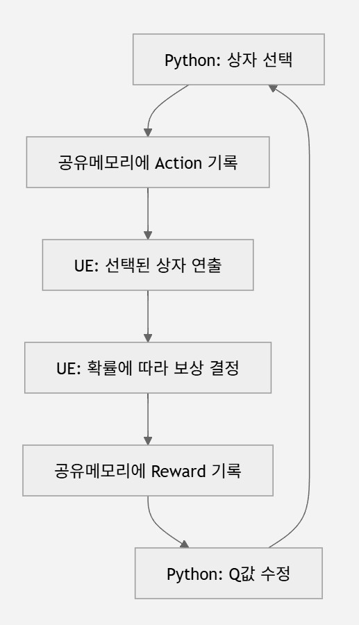
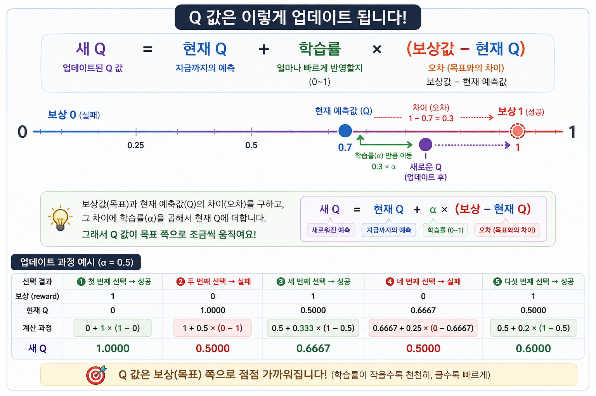

# RL_T1

Unreal Engine과 Python(PyTorch)을 공유 메모리로 연결해 간단한 강화학습 실험을 수행하는 프로젝트입니다.

## 구성

- `RL_T1_UE/`: Unreal Engine 5.7 프로젝트
- `RL_T1_py/`: Python 학습 에이전트

## 동작 방식

1. Python 에이전트가 행동을 선택합니다.
2. 공유 메모리에 행동과 상태 플래그를 기록합니다.
3. Unreal 쪽 GameMode가 행동을 읽고 보상을 계산합니다.
4. Python이 보상을 받아 Q 값을 업데이트합니다.

공유 메모리 이름은 `Global\shared_mem_RL_1`입니다.

## 예제 배경

이 프로젝트는 "왼쪽·오른쪽 보상 상자" 예제에서 시작했습니다.

캐릭터 앞에 상자 두 개가 있습니다.

- 왼쪽 상자: 보상 확률 30%
- 오른쪽 상자: 보상 확률 80%

Python은 매번 하나를 선택합니다.

- `Action 0`: 왼쪽 상자 선택
- `Action 1`: 오른쪽 상자 선택

보상은 성공 시 `+1`, 실패 시 `0`입니다. 처음에는 무작위로 고르지만, 학습이 진행되면 보상 확률이 높은 오른쪽 상자를 더 많이 선택하게 됩니다.

여기서 `Q`는 `Quality`를 뜻하며, "이 행동이 얼마나 좋은가"를 나타내는 예상 점수입니다.



이 예제는 강화학습에서 가장 단순한 `Multi-Armed Bandit` 문제입니다.

- `Bandit`: 슬롯머신
- `Multi-Armed Bandit`: 손잡이가 여러 개인 슬롯머신
- 목표: 각 손잡이의 당첨 확률을 시행착오로 알아내는 것

## 핵심로직

```py

def learn(self, action, reward):
    self.action_counts[action] += 1
    count = self.action_counts[action].item()
    learning_rate = 1.0 / count
    self.q_values[action] += (learning_rate *(reward - self.q_values[action]))
```
## 실행

## 실행 순서

반드시 아래 순서로 실행해야 합니다.

1. 관리자 권한 PowerShell에서 Python 에이전트를 먼저 실행합니다.
2. Unreal Editor를 관리자 권한으로 실행합니다.
3. Unreal Editor에서 `RL_T1_UE/RL_T1_UE.uproject`를 열고 Play를 실행합니다.

Python과 Unreal 모두 관리자 권한으로 실행해야 합니다. 공유 메모리 이름에 `Global\`이 붙어 있고, 두 프로세스가 모두 공유 메모리에 값을 쓰기 때문입니다.

### Python

```powershell
cd RL_T1_py
uv sync
uv run python main.py
```

학습 결과는 `RL_T1_py/log.txt`에서 확인할 수 있습니다.

### Unreal

1. Unreal Editor를 관리자 권한으로 실행합니다.
2. `RL_T1_UE/RL_T1_UE.uproject`를 엽니다.
3. Python 스크립트가 실행 중인 상태에서 Play를 실행합니다.

## 주요 파일

- `RL_T1_py/main.py`: 에이전트 학습 및 공유 메모리 관리
- `RL_T1_UE/Source/RL_T1_UE/GM_ProjectDefault.*`: Unreal 공유 메모리 연동 및 보상 처리

## 요구 사항

- Python 3.11
- uv
- PyTorch 2.5.1 CUDA 12.4
- Unreal Engine 5.7
